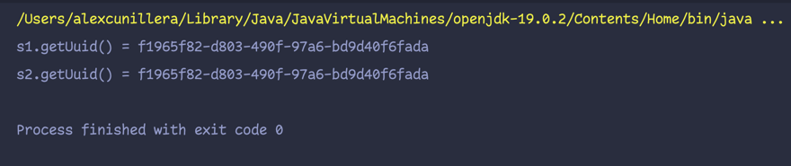

# Clase Singleton

```java
package org.alex;

import java.util.UUID;

public class Singleton {

    private static Singleton instance = null;
    private static Object mutex = new Object();
    private UUID uuid;

    private Singleton() {
        uuid = UUID.randomUUID();
    }

    public static Singleton getInstance() {
        if (instance == null) {
            synchronized (mutex) {
                instance = new Singleton();
            }
        }
        return instance;
    }

    public static void main(String[] args) {
        Singleton s1 = Singleton.getInstance();
        Singleton s2 = Singleton.getInstance();

        if (s1.equals(s2)) {
            System.out.println("s1.getUuid() = " + s1.getUuid());
            System.out.println("s2.getUuid() = " + s2.getUuid());
        }
    }

    public UUID getUuid() {
        return uuid;
    }

    public void setUuid(UUID uuid) {
        this.uuid = uuid;
    }
}
```

`Què penseu que fa “synchronized (mutex)”?`

##### Synchronized mutex el que fa que només un fil pugi accedir el codi dins del bloqueig, és a dir només crear una instancia del Singleton.

____

`L’altra classe s’anomenarà MainSingleton, la qual haurà de fer:
Instanciar s1 i s2 de tipus Singleton fent ús del mètode getInstance(), per exemple: Singleton s1 = Singleton.getInstance();
Comproveu que en efecte les uuid de s1 i s2 són iguals. Per fer-ho compareu s1 i s2, de tal forma que si són iguals mostreu-lo per pantalla, juntament amb les uuid de s1 i s2.`

`Amb les vostres pròpies paraules, què penseu què està passant i com funciona aquest patró? Per a què ens podria ser d’utilitat?`

#### Al tenir el patró Singleton els dos objectes “Singleton s1 i s2” només crea una instancia es a dir els dos objectas estan creats amb la mateixa instancia el que resulta en ser dos objectes idèntics.

___

